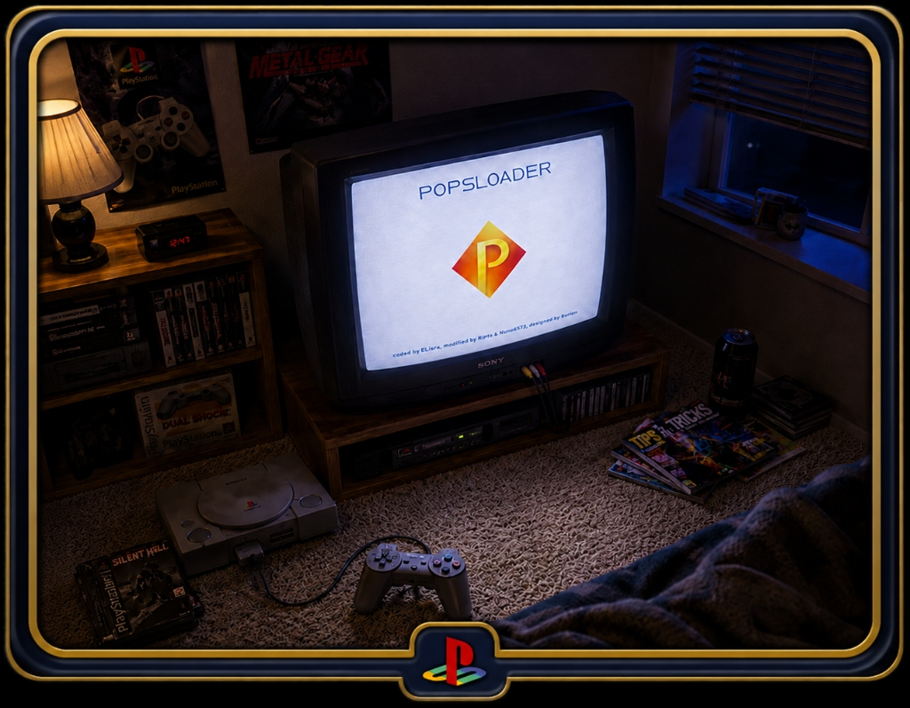

# POPSLoader

<p align="center">
  
</p>

<p align="center">
  <a href="https://mega.nz/folder/W9wXyLjD#8hk7Wv-EEPfKPTDN-guKdQ"></a>
</p>

POPSLoader is a graphical PlayStation 2 homebrew launcher designed to easily browse and launch your PS1 games (using POPStarter) from various storage devices. It features a clean, responsive layout, cover art support, sound effects, an on-screen keyboard, and direct memory card exit shortcuts.

The current public release is **1.0.1** (released 2026-07-13). Rolling test artifacts continue to be published from the `dev` branch (see [Development & Building](#development--building)).

---

## Highlights

POPSLoader's stable backbone, hardware-confirmed across an extended validation pass:

*   **Fixed HDD POPSTARTER Handoff (D-10)**: Resolved the long-standing "D-10" black-screen hang when launching games using an HDD-backed POPStarter configuration. Hardware-confirmed.
*   **Fixed Cross-Device POPSTARTER (D-14 / D-15)**: HDD-backed POPSTARTER with non-HDD games and non-HDD POPSTARTER with HDD games both launch cleanly. Hardware-confirmed.
*   **DKWDRV from Memory Card and custom HDD path**: Both launch routes work — the MC route via a reboot-IOP path with synthesized argv, the HDD custom path via a partition-aware route. Hardware-confirmed.
*   **BOOT.ELF Exit from POPSLoader**: Returns to wLaunchELF / BOOT.ELF via the embedded-loader route, including the previously broken HDD-launched case (`U-10`). Hardware-confirmed.
*   **Single-device Settings parity**: Every install — USB / MX4SIO / MMCE **and the internal HDD** — saves settings to `.pldrs` next to the launcher. HDD installs write it on the HDD's own boot partition (read-write mount take-over), no `mc0:` fallback (see [Settings Storage on HDD Installs](#settings-storage-on-hdd-installs)).
*   **In-app HDD game hiding, PAL full-screen, BDMA + MC-folder controls**: The newer Settings work — see the [Settings](#settings) section below.
*   **Polished User Interface**: Layout alignment corrections, cleaner typography, dynamic menu box adjustments, text wrapping, and notification toast hardening.

> [!NOTE]
> The canonical, always-current **Known Issues** list and **hardware-verification status** live in **[STATE.md > Known Issues](STATE.md#known-issues-canonical--the-single-list-readme--agents--rolling_notes-point-here)** (with the full ledger in [QA_REGRESSION_MATRIX.md](QA_REGRESSION_MATRIX.md)). The current open item is the config-specific "Failed to load HDD" from a non-HDD boot; the 2026-06 HDD/PAL/BDMA features are implemented and boot on PCSX2 (HDD confirmed read-write on hardware by provato) and are still validating on hardware.

---

## Supported Devices

POPSLoader's main menu exposes the following backends:

*   **MMCE** (Multi-Memory Card Emulator, e.g. MemoryCard PRO / SD2PSX)
*   **MX4SIO** (SD card via memory card slot adapter)
*   **HDD (PFS)** (internal HDD via the PS2 network/ATA adapter)
*   **USB** (`mass:`)
*   **HDD (exFAT)** (`mass:` via BDMA Mode `ATA` — an internal SATA/IDE drive formatted exFAT; **new — validating on hardware**)
*   **Disc (DKWDRV)** (boot DKWDRV to play PS1 discs)

> [!NOTE]
> The main menu also lists **i.Link**, but that flow is not implemented yet — selecting it shows a "not implemented" notice. **SMB (v1)** network game browsing is now implemented (CI + Rolling green) and is validating on hardware. (**HDD (exFAT)** is likewise implemented via BDMA Mode `ATA` and is validating on hardware.) See [Known Issues & Planned Improvements](#known-issues--planned-improvements).

> [!NOTE]
> Game compatibility and drive loading performance may vary depending on your specific console model, adapter type, and the quality of your POPStarter/POPS binaries.

---

## Quick Install

To set up POPSLoader:

1.  **Download the Release**: Download and extract the latest `POPSLOADER.zip` package.
2.  **Copy Launcher Files**: Copy the `PS1_POPSLOADER/` folder to the device or memory card from which you want to launch POPSLoader.
3.  **Place POPS Files**: Put the `PATCH_5.BIN` file (included in the `POPS/` directory of the ZIP) into your active `POPS` folder (see directory structures below).
4.  **Add POPStarter & POPS Files**: Add your POPStarter executable (`POPSTARTER.ELF`) and the required POPS support files (`IOPRP252.IMG`, `POPS.ELF`, `POPS.PAK`, `POPS_IOX.PAK`) to your `POPS` folder. These copyrighted Sony POPS files are not included in the release package.
5.  **Add Games**: Copy your PS1 game images in `.VCD` format into the same `POPS` folder. Keep filenames reasonably short — roughly **73 characters is the safe maximum** for a standard `POPS/` folder; longer names can fail to launch (see Troubleshooting).
6.  **Launch**: Run `POPSLOADER.ELF` using wLaunchELF, Free McBoot, or your preferred ELF launcher.

---

## Folder Layout

Ensure your directories and files match these paths exactly depending on your storage device:

### USB / MX4SIO / MMCE Setup
Place all files on the root of your storage device (`mass:/`, `mx4sio:/`, `mmce0:/`, etc.) in a folder named `POPS`:

| File Path | Description |
| :--- | :--- |
| `<device>:/POPS/GameName.VCD` | Your PS1 game image |
| `<device>:/POPS/ART/GameName.png` | Optional cover art (200x200 8-bit PNG recommended). The `POPS/ART/` subfolder is the default location, checked first; a `<device>:/POPS/GameName.png` beside the VCD always works as a fallback. You can pick where covers (and the matching `GameName.txt` *Game details* sidecar) are looked for first in *Settings → Game List → Cover/details folder*: **POPS/ART** (default), **POPS** (beside the game), or a top-level **ART** folder at the device root. |
| `<device>:/POPS/IOPRP252.IMG` | Required POPS support file |
| `<device>:/POPS/POPSTARTER.ELF` | POPStarter launcher binary. A `POPSTARTER.ELF` dropped here is used automatically for that device's games (so you can keep, say, a USB-delay build on the USB drive without forcing it everywhere) — unless you set an explicit **POPSTARTER Path**, which always wins. See [Settings](#other-settings). |
| `<device>:/POPS/POPS.ELF` | POPS emulator engine binary |
| `<device>:/POPS/POPS.PAK` | Emulator resources payload |
| `<device>:/POPS/POPS_IOX.PAK` | Emulator input/output resources payload |

### Internal HDD Setup: HDD (PFS) / APA partitions
This layout is for the classic **HDD (PFS)** drive (Sony APA partitions via the network/ATA adapter). Place VCD game files inside your dedicated POPS partitions, and system binaries inside `__common/POPS/`:

| File Path | Description |
| :--- | :--- |
| `hdd:/__.POPS/GameName.VCD` | Your PS1 game image (can also use partitions `__.POPS0` through `__.POPS9`) |
| `hdd:/PP.GameName/IMAGE0.VCD` | *(new, validating on hardware)* A **partition-installed** game (HDDOSD / PSBBN style: one partition per game, `PP.` visible or `__.` hidden, image always named `IMAGE0.VCD`). These are listed on the HDD page under the partition's name and launched with POPStarter's `PP.GameName.ELF` convention. |
| `hdd:/__common/POPS/ART/GameName.png` | Cover art folder (partition-installed games use the partition name minus its `PP.` / `__.` prefix) |
| `hdd:/__common/POPS/IOPRP252.IMG` | Required POPS support file |
| `hdd:/__common/POPS/POPSTARTER.ELF` | POPStarter launcher binary |
| `hdd:/__common/POPS/POPS.ELF` | POPS emulator engine binary |
| `hdd:/__common/POPS/POPS.PAK` | Emulator resources payload |
| `hdd:/__common/POPS/POPS_IOX.PAK` | Emulator input/output resources payload |

> **An exFAT internal drive is set up differently (like a USB drive, not like this).** The **HDD (exFAT)** drive (BDMA Mode `ATA`) mounts as `mass:` and uses the **same flat layout as a USB / removable drive**, not APA partitions. Put a single `POPS/` folder at the drive's root holding your `.VCD` games and the POPS system files (`PATCH_5.BIN`, `IOPRP252.IMG`, `POPS.ELF`, `POPS.PAK`, `POPS_IOX.PAK`, `POPSTARTER.ELF`), exactly like the **USB / removable** table above (`<device>:/POPS/...`), with covers under `POPS/ART/`. Do **not** create `__.POPS` partitions or a `__common/` folder on an exFAT drive.

---

## Controls

Navigate POPSLoader using a standard PS2 controller.

### Menus & Game List

| Button | Action |
| :--- | :--- |
| **D-pad Up / Down** | Scroll through the game list |
| **D-pad Left / Right** | Page Up / Page Down (jump through large lists) |
| **L1** | Jump to the top of the game list — press again to bounce to the bottom |
| **Left Analog Stick (up / down)** | Navigate the game list item-by-item — the stick folds into the d-pad, so a held push scrolls smoothly with the same auto-repeat (only an analog/DualShock pad's stick is read; a digital pad is ignored). Push the stick **left / right** to page-jump like the d-pad. |
| **R1** | Refresh / rescan the current device's game list, in place (e.g. after hot-plugging a drive or card). USB / MMCE / MX4SIO / HDD (PFS) re-scan live by default; if *Game list cache* is enabled in Settings they instead rebuild their saved per-device cache. |
| **Cross (X)** | Confirm option / Launch selected game. On a **Japanese-ROM console** the convention flips automatically: **Circle confirms and Cross cancels** (POPSLoader reads `rom0:ROMVER` at boot), and every on-screen button hint follows. |
| **Circle (O)** | Go back to the Main Menu / Cancel (Cross on a Japanese-ROM console) |
| **Triangle (△)** | Open the Credits screen (any button returns you to where you were). Exit shortcuts, including BOOT.ELF where available, live in the Exit menu opened with **Circle** on the Main Menu. |
| **Start** | Open Settings |
| **Select** | Toggle "Hide Text Mode" (clears the UI for a clean view of cover art) |
| **Square (□)** | Toggle cover-art preview on / off (in the game list) |
| **Right Analog Stick (up / down)** | Scroll a long game description that doesn't fully fit on screen (when *Game details* are enabled and a `<game>.txt` is present). |
| **L3 (left stick click)** | Hide / unhide the selected game (writes/removes a `<name>.hide` marker — works on every device, including the internal HDD). Set *Settings → Game List → Hidden games* to *Visible (manage)* to show hidden games dimmed, then press **L3** on a dimmed entry to unhide it. |
| **R3 (right stick click)** | Reveal / re-hide this device's hidden games — a **temporary view for this session only**. When *Settings → Game List → Hidden games* is set to *Hidden* (games filtered out of the list), press **R3** to rebuild the list with them shown dimmed so you can manage them (then **L3** unhides); press **R3** again to hide them. Nothing is saved: the persisted setting lives in *Settings → Game List → Hidden games* and comes back in force when you leave the page or reboot. |
| **R2** | Launch in "HDD Alt" mode (HDD (PFS) game list only — for an HDD-resident POPSTARTER) |

### On-screen Keyboard (Settings path editor)

| Button | Action |
| :--- | :--- |
| **L1 / R1** | Move the text cursor Left / Right |
| **Square (□)** | Delete character (backspace) |
| **R2** | Toggle uppercase / symbols — letters shift to UPPERCASE, and the digit/bracket keys type `@ # $ % ^ * " < > \| { } ~ \`` (for usernames, hidden shares ending `$`, and symbol passwords). The on-screen label always names the mode R2 will **switch to**. |
| **Circle (O)** | Close the keyboard. With unsaved typing it asks for a **second press** (within ~1.5 s) before discarding |

The keyboard opens **uppercase with the cursor on the first letter row** and the **number row sits at the top**. The layout itself (QWERTY / DVORAK / ABC / AZERTY / QWERTZ / ABNT) is picked in *Settings → Startup → Keyboard Layout*.

---

## Settings

Press **Start** on the menu to open Settings. Inside Settings, **Start** opens the **Save Changes / Reset Defaults / Discard & Exit** menu (they are no longer rows in the list); changes save when you confirm. Settings persist per install with **single-device parity** — every device, **including the internal HDD**, saves a `.pldrs` file next to the launcher. HDD installs write that sidecar **on the HDD boot partition itself** (POPSLoader remounts its own boot partition read-write to do so — there is no `mc0:` fallback for HDD installs). For the full rules, see **[STATE.md > Settings](STATE.md#settings-single-device-parity)**.

### Startup

| Setting | Options | What it does |
| :--- | :--- | :--- |
| **Boot Page** | **Carousel** (default) · MX4SIO · USB · MMCE · HDD (PFS) · HDD (exFAT) | Where POPSLoader lands after the boot sequence. *Carousel* shows the normal device wheel. Pick a device and POPSLoader opens **straight into that device's game list** at startup (it loads that backend automatically). If the chosen device is hidden (e.g. an HDD Boot Page after switching *Internal HDD* the other way), boot lands on the carousel with a message saying why. A `-page=` launch argument still overrides this for that one boot. |

### Carousel Devices

| Setting | Options | What it does |
| :--- | :--- | :--- |
| **(one row per device: MMCE, MX4SIO, USB, i.Link, SMB, Disc)** | **Shown** (default) · Hidden | Hide or show each entry on the main device carousel. Set unused or not-yet-implemented backends (e.g. i.Link) to **Hidden** to remove them from the wheel. At least one device must stay **Shown**. Saved with your settings (`HIDDEN_DEVICES`); hidden entries are skipped during carousel navigation with no gaps, and launch behavior is unchanged. |
| **Internal HDD** | **PFS (default)** · exFAT (APA-Jail) | Picks which of the two internal-HDD pages shows on the carousel — the classic Sony APA/PFS page, or the APA-Jail **exFAT** page (BDMA ATA backend). They are **mutually exclusive**: one shows, the other hides (saved as `HDD_FS`). A `-page=ata` (or `exfat`) launch argument still opens the exFAT page regardless of this setting. |

### Game List

| Setting | Options | What it does |
| :--- | :--- | :--- |
| **Multi-disc games** | **Show all discs** (default) · First disc only | *First disc only* hides the secondary discs of multi-disc games so only disc 1 shows. **Detection is purely by filename** — a disc is hidden if its name contains `(Disc 2)`, `(Disc 3)`, `(CD 2)`, `(Disk 2)`… (any number ≥ 2). So it **only works if you name your files with that convention**, e.g. `Final Fantasy IX (Disc 1).VCD` / `Final Fantasy IX (Disc 2).VCD`. Launch disc 1 and swap discs in-game via your VMC. (PS1 discs carry no shared "this is the same game" metadata, so the filename is the only signal.) Applies to every device. |
| **Hidden games** | **Visible (manage)** (default) · Hidden | Per-game hide layer. Press **L3** on any game to hide or unhide it — hiding writes (or removes) a tiny `<name>.hide` marker next to the game's `.VCD`, exactly like the `<name>.png` cover. *Hidden* filters tagged games out of the list; *Visible (manage)* shows them **dimmed** so you can manage them with L3. In-app hiding works on **every device** — USB / MX4SIO / MMCE / Memory Card **and the internal HDD** (POPSLoader writes the `.hide` on the HDD via its read-write boot-partition mount). |
| **Game details** | **Off** (default) · Left · Center · Right | Shows a per-game blurb from a `<game>.txt` sidecar in a small panel under the cover, in the chosen text alignment (*Off* hides it). The `.txt` is sought right alongside the cover (in whichever location *Cover/details folder* is set to, `POPS/ART/` by default, with the game's own `POPS/` folder always also checked), and the disc-marker-stripped name is tried first so one file serves every disc of a multi-disc game. Authored line breaks are preserved; scroll a long blurb with the **right analog stick**. |
| **Cover/details folder** | **POPS/ART** (default) · POPS (beside game) · ART (at root) | Picks where each game's cover `.png` and its `.txt` details sidecar are looked for **first** on removable devices (USB / MX4SIO / MMCE): a `POPS/ART/` subfolder, the game's own `POPS/` folder beside the `.VCD`, or a top-level `<device>:/ART/` folder. The game's own `POPS/` folder is always also checked as a fallback, so art beside the `.VCD` never stops showing. The internal HDD keeps its fixed `__common/POPS/ART/` layout. |
| **Game list cache** | **Off** (default) · On | When **On**, USB / MMCE / MX4SIO **and the internal HDD (PFS)** save their scanned game list per device so the "Building game list…" rescan only runs once (rebuild it with **R1**). **Off** = always live-scan (the default, unchanged behavior). |

### Other settings

- **POPSTARTER Path** — which `POPSTARTER.ELF` to use. Leave it on **Automatic** (the default) and POPSLoader resolves it per device at launch: **(1)** the game device's own `<device>:/POPS/POPSTARTER.ELF` if present — on the internal **PFS HDD** this step is `hdd0:__common/POPS/POPSTARTER.ELF` instead; **(2)** the `POPSTARTER.ELF` next to where `POPSLOADER.ELF` launched from; **(3)** the `mc0:`/`mc1:/POPSTARTER` fallback. Or set an explicit path — it is tried **first**, and if it doesn't resolve (drive unplugged, typo) the launch silently falls back to the same Automatic order; you're only warned when **no** `POPSTARTER.ELF` is found anywhere. (The old 16-entry Profile preset list is gone — and if you had a preset selected, it's carried over into this path automatically on first boot, so nothing stops launching. No more `pfsN` partition numbers on screen.) Clearing the path in the editor returns it to Automatic.
- **DKWDRV Path** — path to `DKWDRV.ELF` used by the Disc option.
- **Video Standard** — **Auto** (default — matches your console's region) / NTSC / PAL. On PAL the UI now renders **natively at 640×512** so it fills the whole screen with no letterbox (NTSC is 640×448). A display-mode change shows a confirm prompt that **auto-reverts** if you don't confirm, so a bad mode can't strand you; you can also hold **Start** during boot to skip past a bad video mode.
- **Overscan (CRT inset)** — **Off** (default) up to a numeric inset, adjusted in steps of **5** (OPL-style render inset, same math as OPL's overscan). Pulls the whole UI slightly toward the center of the screen so nothing is lost in a CRT's overscan border. The change previews live as you adjust it; backing out of Settings without saving restores the previous value. *(Mainly useful on a real CRT; on a flat panel you'll usually leave it Off.)*
- **Boot sound** — **On** (default) / Off. Plays the startup chime over the boot splash. Turn it **Off** for a silent boot. (Hardware-confirmed to save and survive a reboot.)
- **BDMA Mode** — mass-storage backend mode: **FAT32** (`FAT32-USB (None)`) / **USBEXFAT** (`exFAT-USB`) / **MX4SIO** / **MMCE** / **ATA** (`exFAT-HDD (ata)` — an internal SATA/IDE drive formatted exFAT; *new, validating on hardware*). The installed mode is recorded in a `bdma_mode.txt` marker file in the POPSTARTER pack folder (older `.pldr_bdma_mode` markers are still read for compatibility).
- **Adaptive BDMA** — *(new, validating on hardware)* stages the right BDMA drivers for the **game you launch**, automatically, so MMCE and USB (and MX4SIO / exFAT-HDD) games can coexist without flipping BDMA Mode between launches. It checks first and skips the write when the correct drivers are already on the card. The USB page can't tell FAT32 from exFAT drives, so there your saved **BDMA Mode** decides: `exFAT-USB` keeps the exFAT drivers for USB launches, anything else means your USB drive is FAT32 (drivers removed, POPStarter's built-in stack used). Default **Off**.
- **POPSTARTER Memory Card Folder** — toggles the `mc:/POPSTARTER` folder. Turning it **off deletes** `mc:/POPSTARTER` (with a confirm prompt). It is **interlocked with BDMA Mode**: you can't turn this folder off while BDMA Mode is on (or while Adaptive BDMA is on), and you can't enable either while this folder is off.
- **Hide UI Text** — **On/Off**; clears on-screen text for a clean cover-art view (also toggled with **Select**).
- **Keyboard Layout** — on-screen keyboard layout for the path editor (QWERTY / DVORAK / ABC / AZERTY / QWERTZ / ABNT). This is the only place the layout is chosen; the keyboard itself no longer carries a layout strip.

### SMB / Network

Browse and launch PS1 games from an **SMBv1** network share via the **SMB** carousel entry. Networking is **lazy**: nothing network-related runs at boot; the stack comes up only when you open the SMB page. *(New feature — validating on hardware.)*

| Setting | Default | What it does |
| :--- | :--- | :--- |
| **SMB modules** | Not installed | Installs the in-game SMB streaming pack (6 IRX + `SMBCONFIG.DAT`/`IPCONFIG.DAT`) into `mc:/POPSTARTER` on Save. **Required to LAUNCH games** — browsing works without it, and the loader warns (and blocks a launch) when it's missing. Interlocked with the *POPSTARTER Memory Card Folder* toggle. |
| **IP assignment** | DHCP | DHCP or Static. Static uses the **PS2 IP / Netmask / Gateway / DNS** rows (validated as dotted quads). |
| **Link mode** | Auto | Ethernet negotiation (Auto / 100 full / 100 half / 10 full / 10 half). |
| **Server IP** | 192.168.0.1 | The SMB server's IP address. (NetBIOS names are not supported — use the IP.) |
| **Port** | **1111** | The server's SMB TCP port. **Stock SMB servers listen on 445** — the 1111 default suits alternate-port SMBv1 setups (e.g. the PS2-Servers configs); set it to whatever your server actually listens on. Written into `SMBCONFIG.DAT` as `SERVER:PORT` (445 is implied and omitted). |
| **Share** | *(not set)* | The share name. **Leave it blank** and the SMB page lists the server's shares in an in-app picker; your choice is saved. |
| **User / Password** | *(guest)* | Credentials, when the share needs them (either one set = credentials are used, in-app and in-game). Values are trimmed except the password; the R2 symbol shift types `@ # $ %` etc. |
| **Games path (folder holding POPS)** | *(share root)* | Optional folder under the share that CONTAINS your `POPS/` folder. **Browsing only**: POPStarter launches from `<share>/POPS`, so prefer sharing the folder itself and leaving this blank. |

Share layout: `\\server\share\POPS\Game.VCD` (plus the usual POPS support files). Launches hand POPStarter an `SB.<name>.ELF` selector and it streams the `.VCD` from the share using the installed pack's `SMBCONFIG.DAT`.

**SMB fails to connect?** The error names the failing step. "No network link" = cable/adapter; "DHCP failed" = try Static; "Can't reach the server" = check Server IP **and Port** (stock servers = 445); "Server refused SMBv1" = enable SMBv1 support on the host (modern Windows/Samba disable it by default); "SMB login failed" = credentials; "Share not found" = share name (or use the blank-Share picker).

---

## BOOT.ELF / wLaunchELF Exit

Selecting **BOOT.ELF** in the exit menu (or pressing the **Triangle** shortcut) will look for:
1. `mc0:/BOOT/BOOT.ELF`
2. `mc1:/BOOT/BOOT.ELF`

If found, BOOT.ELF launches through the embedded-loader handoff with a clean BRAM setup and an explicit `argv[0]`. If you do not have wLaunchELF installed at these paths, this option will fail to boot.

**Hardware-confirmed working** when POPSLoader was launched from USB, MC, MMCE, MX4SIO, OSDmenu, Browser, PSBBN, or HDD.

The `U-10` case (BOOT.ELF exit from an HDD-launched POPSLoader) previously black-screened; it was **fixed in PR #479** (`reboot_iop=0`), hardware-confirmed by Nuno 2026-05-31. History in [docs/archive/U10_INVESTIGATION.md](docs/archive/U10_INVESTIGATION.md).

---

## Internal HDD Notes

*   Internal HDD setups received major reliability improvements in BETA-10-5 (the "B2" PFS-unmount fix at commit `4ae6679`), correcting the partition mount handoffs that previously prevented games from loading.
*   Ensure that your game partition is named matching the `__.POPS` convention, and that the `__common/POPS/` directory contains all necessary POPStarter/POPS emulator binaries.
*   Existing USB/MX4SIO/MMCE setups are unaffected by the HDD fixes and should continue to work normally.

### Settings Storage on HDD Installs

HDD-installed POPSLoader saves its `.pldrs` settings file **on the HDD itself**, in the launcher's boot partition — same single-device behavior as USB / MX4SIO / MMCE, which keep the sidecar at `<install dir>/.pldrs`. To do this POPSLoader takes over its own boot partition's mount and remounts it read-write (the OPL "own your mount" pattern), so there is **no `mc0:` fallback** for HDD installs. The same read-write mount is what lets in-app `.hide` markers (toggled with L3) be written on the HDD. See **[STATE.md > Settings](STATE.md#settings-single-device-parity)** for the canonical rules.

---

## Troubleshooting

### Game does not appear in the menu list
*   Using uppercase `.VCD` is recommended if your games are not being detected, especially on case-sensitive setups.
*   Verify that VCD files are placed directly in the `POPS` (or `__.POPS`) folder, not inside subfolders.

### Game launches to a black screen
*   Verify that `IOPRP252.IMG`, `POPS.ELF`, and the `.PAK` files are present in the POPS folder.
*   Check that your game image `.VCD` is healthy and uncorrupted.

### A game appears in the list but won't launch
*   The most common cause is the **`.VCD` filename being too long**. POPStarter — not POPSLoader — performs the actual launch and enforces a hard length limit. In testing, a **73-character** filename launches while a **74-character** one does not.
*   POPStarter's own documentation lists an **89-character** limit, but that ceiling appears to count the **full path string POPStarter builds** (POPSLoader hands it something like `mass:/POPS/XX.<name>.ELF`), not just the bare filename. So the usable *filename* length is shorter than 89, and a **deeper folder path leaves room for fewer characters** — which is why ~73 is the safe target for a standard `POPS/` folder.
*   **Fix:** shorten the filename (and, if needed, use a shorter folder path). This is a POPStarter constraint and cannot be raised from POPSLoader.

### Cover art is not showing up
*   Check that the cover image is in `.png` format.
*   The PNG filename must match the `.VCD` game filename (e.g. `Crash Bandicoot.VCD` requires `Crash Bandicoot.png`). For a multi-disc game, the disc-marker-stripped name (`Crash Bandicoot.png`) is tried first so one cover serves every disc; an exact per-disc name still works.
*   Place the cover in the folder chosen by *Settings → Game List → Cover/details folder* (default `POPS/ART/`, also **POPS** beside the game or a top-level **ART** at the device root). A PNG sitting beside the `.VCD` always works as a fallback regardless of that setting. On the internal HDD covers live in `__common/POPS/ART/`.
*   Confirm cover-art preview is enabled — press **Square (□)** in the game list to toggle it.
*   For best compatibility and performance, use 200x200 pixel images.

### BOOT.ELF exit option fails or hangs
*   Confirm that a valid wLaunchELF executable is installed on your physical memory card at `mc0:/BOOT/BOOT.ELF` or `mc1:/BOOT/BOOT.ELF`.

---

## Known Issues & Planned Improvements

Confirmed broken: see the single canonical **[STATE.md > Known Issues](STATE.md#known-issues-canonical--the-single-list-readme--agents--rolling_notes-point-here)** list (currently: the "Failed to load HDD" from a non-HDD boot case, and the SMB connect failure whose root cause is fixed in code and awaiting its first hardware run — the full 2026-07-07 audit and fixes are in [docs/REPO_AUDIT_2026-07-07.md](docs/REPO_AUDIT_2026-07-07.md)).

Planned for subsequent updates:
*   **Layer C Lazy IRX Loading**: Defer device-specific IRX modules so they only load when the boot device family needs them, reducing boot time. The `mmceman` portion has **landed** (PR #471): it is now loaded eagerly only when POPSLoader is booted from an MMCE device, and deferred everywhere else. Further deferral of `ds34bt` / `usbd` was **declined** (2026-06-22): both hard-import `usbd` and the only available defer trigger is the boot device family — not the same as pad transport — so deferring them would strand USB / Bluetooth controller input (unrecoverable without a reboot) for a small boot-time gain. They are kept loaded eagerly; the Layer C effort is closed at the `mmceman` win.
*   **Settings UI Redesign (Berion)**: Visual overhaul replacing the current OPL-style focused-list with per-category Settings pages. Awaiting Berion's mockup PNGs.
*   **GUI Themes**: Customizable colors / skins / fonts and a setting to skip the boot splash.
*   **In-Game Features**: Support for per-game fixes, cheat codes, Virtual Memory Card (VMC) setups, and multi-disc swap prompts.
*   **`HDD (exFAT)`** menu flow: now **implemented** as a `mass:` backend via BDMA Mode `ATA` (built, CI/Rolling green) — **validating on hardware**.
*   **`SMB (v1)`** network game browsing: now **implemented** (settings, an "SMB modules" install toggle, lazy connect, share browse, launch, and disconnect-on-exit; built, CI/Rolling green) — **validating on hardware**.
*   **`i.Link`** menu flow: currently surfaces as "Not Implemented Yet" until feature work lands.

See [STATE.md](STATE.md) "Known Open Work" and [ROADMAP.md](ROADMAP.md) for the prioritized backlog.

---

## Credits

*   **israpps (El_isra)**: Original POPSLoader project creator.
*   **Daniel Santos**: Creator of the Enceladus runtime foundation.
*   **krHACKen**: Author of POPStarter.
*   **Berion**: User interface design and theme assets.
*   **nuno6573**: Cover-art engine integrations and scripting.
*   **Hugopocked**: POPStarter fixes.
*   **saildot4k**: BDMA-ATA (exFAT internal-HDD / ATA backend), fixes, feedback, and oversight.
*   **Ripto / NathanNeurotic**: Maintenance, UI polishing, and release engineering.
*   **P4NCHOL1NO, VizoR, provato, nuno6573, TnA-Plastic, and the community**: Hardware testing.

---

## Development & Building

GitHub Actions is the canonical build path. The pinned CI image is `ps2dev/ps2dev:v2.0.0`. Every change must pass the CI workflow in `.github/workflows/compilation.yml` before merging; rolling release artifacts for testing are produced by `.github/workflows/rolling-release.yml` on push to `dev` and on pull request events. CI now runs a live `luac` syntax gate over the embedded Lua (`bin/POPSLDR/*.lua` + `etc/boot.lua`) and hard-fails on a syntax error — note this catches **syntax** only; runtime and load-order errors still only surface on real PS2 / PCSX2.

POPSLoader is an EE C/C++ application (`src/`) with the entire front-end UI and launch logic written as embedded Lua (`bin/POPSLDR/*.lua`, `etc/boot.lua`) and an embedded IOP-side child ELF loader (`src/elf_loader/`). The Lua scripts, PNG art, IRX modules, and the child loader are all baked directly into the EE ELF at build time via `bin2c`, so the on-card scripts are not read at runtime — building from source is required to change them.

Developer documentation, repository architecture details, and the current state are maintained in:

*   [STATE.md](STATE.md): Current code and hardware status, the canonical Known Issues list, Behavioral Invariants, and Preservation Contracts.
*   [QA_REGRESSION_MATRIX.md](QA_REGRESSION_MATRIX.md): Complete ledger of CI gates and hardware test outcomes.
*   [ROADMAP.md](ROADMAP.md): Prioritized backlog.
*   [DECISIONS.md](DECISIONS.md): Decision log with rationale and evidence.
*   [ARCHITECTURE.md](ARCHITECTURE.md): Structural data-flow documentation.

To build the launcher binary locally (optional; CI is canonical), run:
```sh
make clean elfloader all
```
This cleans, force-regenerates the embedded child ELF loader (`elfloader`), then compiles every EE/IOP object, embeds all assets, links, strips, and runs `ps2-packer` to produce the packed `bin/POPSLOADER.ELF`. It requires a configured PS2DEV SDK environment (`ps2dev/ps2dev:v2.0.0` toolchain) with `ps2-packer` and the `bin2c` tool on `PATH`.

To grab the latest test build, download from the rolling release URL:
[https://github.com/NathanNeurotic/POPSLoader/releases/download/rolling-release/POPSLOADER-rolling-release.zip](https://github.com/NathanNeurotic/POPSLoader/releases/download/rolling-release/POPSLOADER-rolling-release.zip)

> 🗄️ **Permanent archive (MEGA):** the GitHub `rolling-release` pre-release only ever holds the *latest* build; every push overwrites it. So **every** branch rolling build is also archived permanently to MEGA as one self-contained zip, each in its own immutable `run_<number>` folder (nothing is ever overwritten there). Click the **MEGA Rolling Archive** badge at the top of this README, or [browse the archive here](https://mega.nz/folder/W9wXyLjD#8hk7Wv-EEPfKPTDN-guKdQ), to grab any past build.
